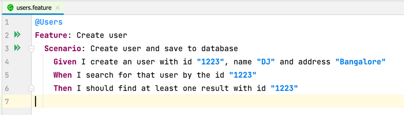
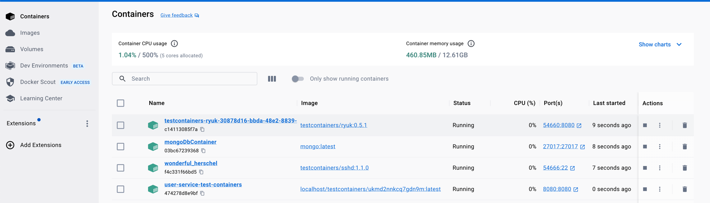
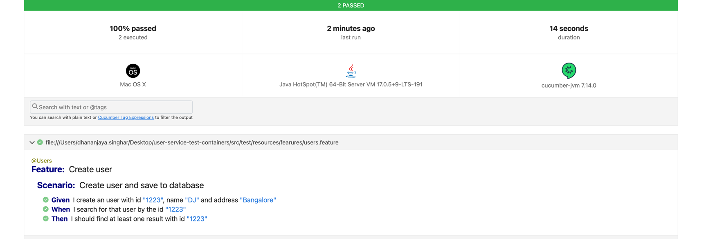
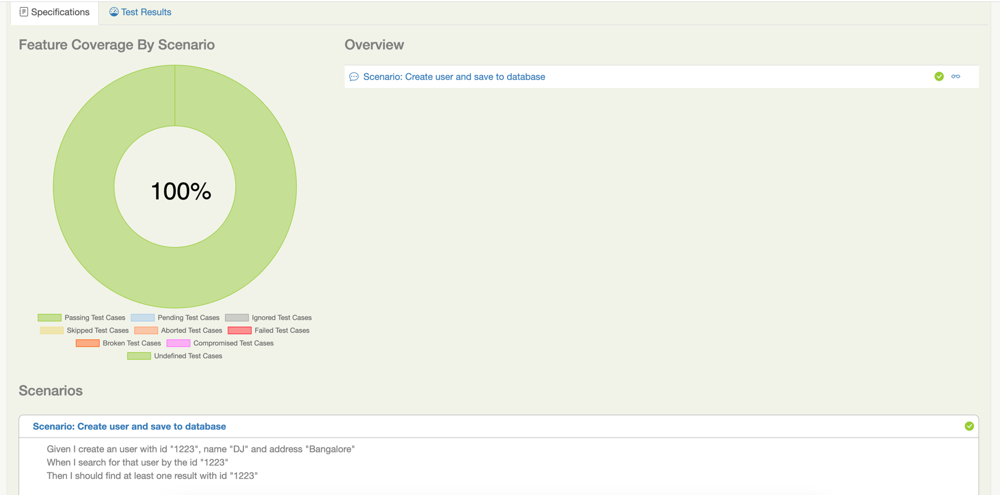
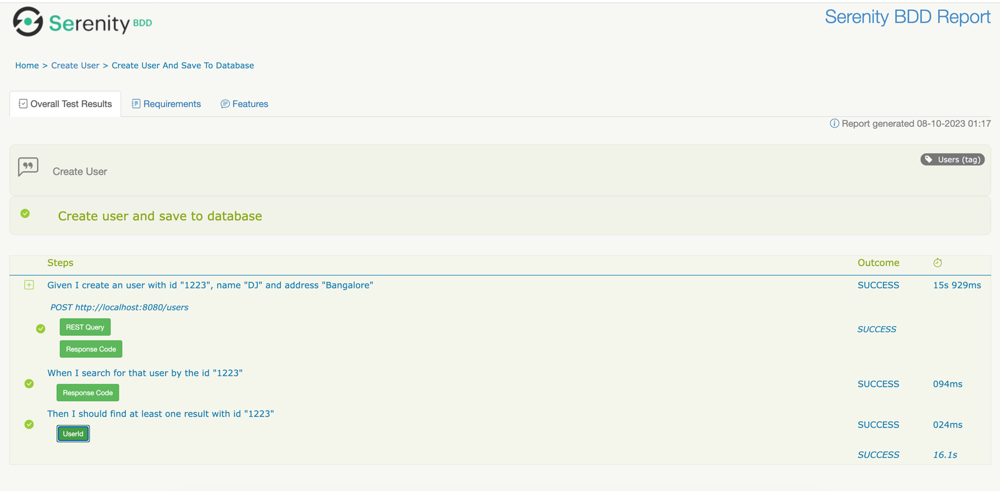

## JUNIT with BDD Cucumber With Serenity

### Feature File

### Test Containers:

### Report Location: target/reports/cucumber.html

### Serenity Report  target/site/serenity/index.html

### Step to run the test
~~~
1. Run mvn clean install
3. Automatically Test will get start
    i. It will run a mongo docker container
    ii. After that it will pick your jar from target folder and will create a docker image.
    iii. Once test run done it will create a test report for both cucumber and serenity and place that inside target/site/serenity/index.html
~~~

### CURL Request for API
~~~
curl --location 'http://localhost:8080/users' \
--header 'Content-Type: application/json' \
--data '{
    "id": "1",
    "name": "DJ",
    "address": "BLR"
}'

curl --location 'http://localhost:8080/users'
~~~